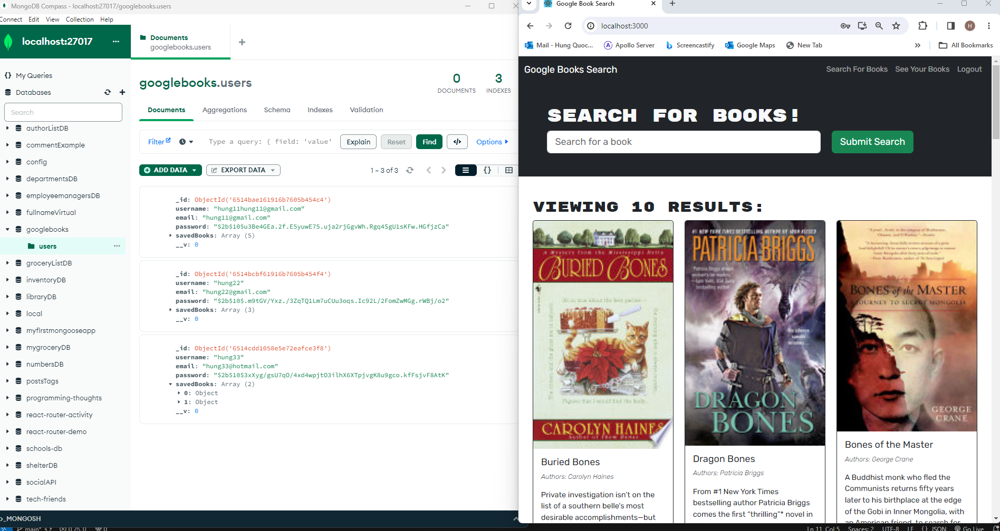

# GoogleBook MERN  by Hung Quoc Dang

## Summary

This MERN codes,  will show the search of books, from Internet, users can save or removed the selected books. To clone it from GitHub then do:

npm i 

npm start

Then a browser will open for users to interact with the page.

Demo: https://drive.google.com/file/d/1xmRZdjaxrxy_xPfJ4nPxCk11eD9KSxCD/view

Github link: https://github.com/HungQuocDang/GoogleBook

Deloyed link: https://hungquocdang.github.io/GoogleBook/

Heroku: error: "application error" for the moment

# MERN_Assignment_Sep29Mod
